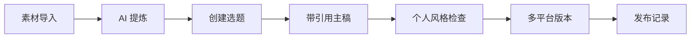

# Notavia Creator

> 把私人素材沉淀为可追溯的内容资产，再把一个观点转成多个平台作品。

Notavia 是面向长期输出者的私有 AI 创作工作台。它支持本地部署、自选模型、网页与多媒体素材导入、带引用写作、个人风格检查和多平台版本管理。

**项目状态：`0.1.0 Alpha`。** 已适合个人自托管试用，暂不承诺集群、高可用、邮件找回、MFA 或企业权限能力。


## 核心能力

- 双模编辑器支持：支持在“富文本”与“Markdown”编辑模式间自由切换；且 Markdown 模式下顶部的快捷格式化工具栏（加粗、斜体、列表、引用、代码块、表格、超链接和多媒体上传）全面生效，方便极速创作。
- 保存富文本、网页、Markdown、图片、音频、视频和语音转写，并保留原始来源。
- 从素材提炼观点、案例、经历、事实和待核实信息。
- 按选题混合检索并固定素材，生成可跳回原文的引用草稿。
- 使用可编辑的个人档案检查观点、套话、虚构经历和无来源事实。
- 将主稿转换为小红书图文和短视频口播稿，记录发布与反馈。
- 使用 Ollama 本地模型或 OpenAI 兼容服务；云模型密钥在服务器端加密保存。



## 快速启动

要求 Docker Desktop 或 Docker Engine + Compose。建议至少 8GB 内存，首次下载模型需要数 GB 磁盘空间。

```bash
cp .env.example .env
./start.sh
```

打开 <http://localhost:8080>。脚本会生成 JWT、云模型凭据加密密钥和可选 PostgreSQL 密码，并把数据保存到 `$HOME/.notavia/data`。

空数据库允许注册首位实例管理员；创建成功后注册默认关闭。需要调整时修改：

```env
REGISTRATION_MODE=first-user # first-user | open | closed
```

## 安全自托管

- 默认只发布 Web 端口，Redis、Ollama、Qdrant、Whisper 和 PostgreSQL 仅能通过 Docker 内部网络访问。
- 公网部署必须使用 HTTPS，并把 `CORS_ORIGIN` 设置为真实访问地址。
- 反向代理与服务端直接连接时，在 `TRUSTED_PROXIES` 中填写代理 IP 或 CIDR；也可以显式设置 `COOKIE_SECURE=true`。
- `.env` 包含解密云模型密钥所需的主密钥，必须单独安全备份，不能提交到 Git。
- 如需本机调试内部端口，显式运行 `docker compose --profile debug up -d`；端口只绑定 `127.0.0.1`。

漏洞报告方式见 [SECURITY.md](SECURITY.md)。

## 数据、备份与迁移

通过 `NOTAVIA_DATA_DIR=/绝对路径` 可修改宿主机数据目录。删除容器或执行 `docker compose down -v` 不会删除该目录。

```bash
./start.sh --backup
./start.sh --restore /path/to/notavia-backup.tar.gz
./start.sh --migrate-volumes  # 从旧版 Docker 命名卷迁移
```

恢复前会自动生成 `pre-restore` 备份；备份和 `.sha256` 文件位于 `${NOTAVIA_DATA_DIR}/backups`。

## 本地开发

要求 Node.js 22、pnpm 9 和 Go 1.26。

```bash
pnpm install --frozen-lockfile
pnpm --filter web dev

cd apps/server
PORT=3001 JWT_SECRET=development-secret-at-least-32-characters go run ./cmd/server
```

提交前运行：

```bash
pnpm --filter web lint
pnpm --filter web build
cd apps/server && go test ./... && go vet ./...
bash scripts/persistence_test.sh
docker compose config --quiet
```

## 路线图与边界

近期重点是完成真实创作闭环、提升素材复用率、完善引用可信度和 30 天自用验证。Alpha 阶段不做团队实时协作、自动发布、平台数据抓取、模型微调、视频剪辑、SaaS 计费或移动原生 App。

项目最初来自创作者“七九”的真实工作流；公开版本使用通用个人风格档案，七九配置仅作为 [`examples/style-profiles/qijiu.json`](examples/style-profiles/qijiu.json) 示例，新用户默认从空白引导开始。

## 参与贡献与许可证

贡献方式见 [CONTRIBUTING.md](CONTRIBUTING.md)，版本变化见 [CHANGELOG.md](CHANGELOG.md)，第三方声明见 [THIRD_PARTY_NOTICES.md](THIRD_PARTY_NOTICES.md)。

Notavia 按 [GNU Affero General Public License v3.0](LICENSE) 发布。通过网络向用户提供修改版服务时，也必须按许可证提供对应源码。
